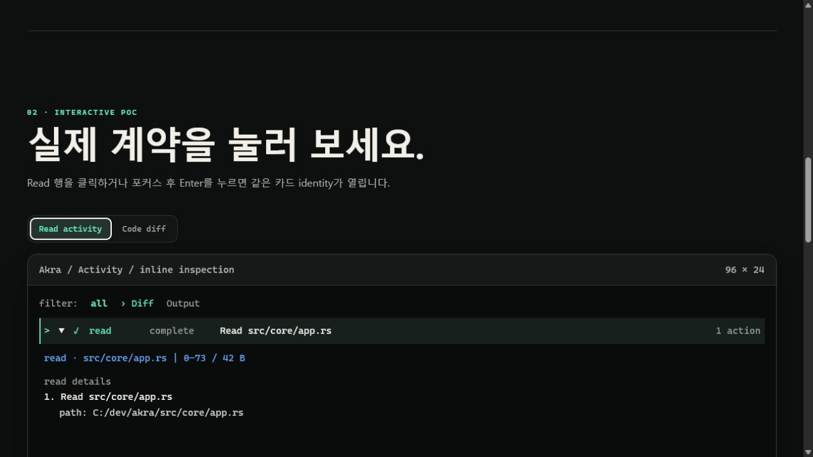
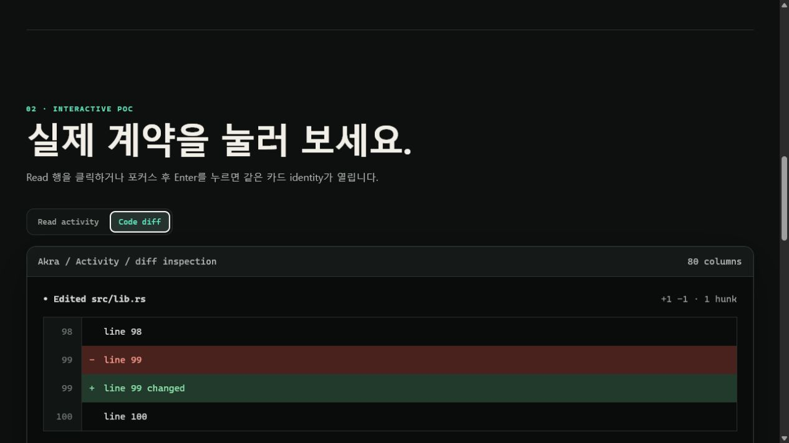

# Tool Read And Diff Progressive-Disclosure PoC

[Open the interactive report](index.html).

This report records the 2026-08-01 research and the shipped Akra TUI proof of concept for two
operator-facing behaviors:

1. keep read/list/search activity to one clear row, then reveal exact retained targets on click or
   `Enter`/`e`;
2. render unified diffs with source line numbers and full-width semantic addition/deletion bands.

The HTML is a renderer-faithful interactive companion, not a substitute terminal implementation.
The production implementation remains Ratatui/Crossterm. Its behavioral proof is in the Rust tests
named in the report, including a real frame receipt and mouse hit-area round trip.

## Decision

- App-server `commandActions` is the typed source for `Read`, `ListFiles`, and `Search` detail.
- Raw shell command text is not retained when typed exploration detail is present.
- A lifecycle-only read still creates an expandable Activity card when command output is empty.
- Collapsed copy identifies the action and target; exact paths, queries, and omitted-detail counts
  exist only in expanded detail.
- Main host scrollback remains static. Click interaction belongs to the Activity inspection overlay;
  transcript `Detail` view provides a keyboard-readable expanded copy.
- Addition and deletion code regions use `#213a2b` and `#4a221d` backgrounds. The line-number
  gutter stays neutral, and wrapped continuations preserve the semantic band.

## Evidence Scope

- local product inspection: Codex CLI `0.146.0`, Grok Build `0.2.117`
- source inspection: current OpenAI Codex and xAI Grok Build repositories
- release behavior inspection: current Anthropic Claude Code changelog
- Akra deterministic renderer: 96x24 collapsed/expanded read activity
- Akra semantic diff renderer: 80-column row-width, gutter, and background assertions
- Akra interaction: left-click collapse and re-expand of a lifecycle-only read card

This evidence establishes presentation and interaction behavior. It does not compare model quality
or claim pixel identity with competitor products.

## Official Sources

- [OpenAI Codex app-server](https://github.com/openai/codex/tree/main/codex-rs/app-server)
- [OpenAI Codex exploration cell](https://github.com/openai/codex/blob/da2c7ca8d16a25f00e09a199524d4f8554ee3977/codex-rs/tui/src/exec_cell/model.rs)
- [OpenAI Codex diff renderer](https://github.com/openai/codex/blob/da2c7ca8d16a25f00e09a199524d4f8554ee3977/codex-rs/tui/src/diff_render.rs)
- [xAI Grok Build](https://github.com/xai-org/grok-build)
- [Anthropic Claude Code changelog](https://github.com/anthropics/claude-code/blob/main/CHANGELOG.md)
