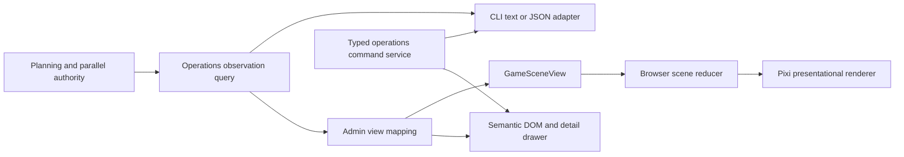

# Admin Game Control Center Master Plan

Status: proposed master plan, implementation pending
Primary surface: local Akra Admin (`/admin/akra`)

## 1. Outcome

게임발전국은 장식용 대시보드가 아니라 Akra의 압축된 운영 화면이어야 한다. 최종 화면에서
operator는 다음 세 질문에 즉시 답할 수 있어야 한다.

1. 지금 어떤 agent가 어떤 task를 어느 단계에서 수행하고 있는가?
2. 무엇이 멈췄고, 왜 멈췄으며, 다음 안전한 조치는 무엇인가?
3. planning, review, delivery, cleanup 중 어디까지 실제로 기록되었는가?

게임 화면의 motion은 이 사실을 더 빨리 읽게 해야 한다. motion 자체가 성공률, 진척률, 처리량을
주장해서는 안 된다. CLI와 Admin은 같은 application use case와 authoritative projection을 사용하고,
각 inbound adapter는 text 또는 web interaction으로만 다르게 표현한다.

이 문서는 장기 제품·상태·권한·품질 계약이다. 실제 병렬 구현 branch와 파일 소유권은 작업 시작
시점에만 `docs/plan/11-parallel-worktree-plan.md`에 기록한다.
Delivery slice는 dependency order를 설명하는 proposed design이며 live backlog가 아니다. 구현이 완료되면
이 문서는 shipped contract로 압축하고 일회성 slice 설명은 제거한다.

## 2. Scope

포함 범위:

- 실제 agent lifecycle과 activity를 표현하는 game scene
- sprite identity, animation clip, station, transition, effect 계약
- desktop, narrow, mobile, keyboard, reduced-motion 경험
- Admin의 doctor/status/queue/task/direction/draft/reset 가시성과 문맥
- CLI와 Admin이 공유할 query/command use case
- 안전하게 한정된 parallel manual action
- asset provenance, 성능, 시각 회귀, rollout 기준

초기 범위에서 제외:

- browser에서 arbitrary shell command 실행
- 별도 Admin process가 TUI의 live conversation, approval, stop 상태를 직접 소유하는 기능
- authority가 없는 progress percentage, success rate, CPU, memory, XP, coin, company level
- 외부 telemetry 전송
- remote Admin bind 또는 multi-user control plane
- WebSocket/SSE를 의미 상태 계약보다 먼저 도입하는 작업
- 신규 sprite 제작을 기존 atlas와 lifecycle 연결보다 먼저 수행하는 작업

## 3. Current Baseline

현재 화면은 배경, object sprite, Korean pixel font, detail drawer, polling, incremental event API,
desktop/mobile capture를 이미 갖고 있다. 시각 자산 기반은 재사용할 가치가 충분하다. 핵심 결함은
데이터 의미와 장면 동작이 연결되지 않은 점이다.

| Boundary | Current fact | Consequence |
| --- | --- | --- |
| `src/adapter/inbound/admin_api/akra_dashboard.rs` | pool, roster, lifecycle, distributor, events를 하나의 Admin view로 mapping한다 | typed fact는 있으나 game scene state와 agent별 transition identity가 없다 |
| `templates/admin/akra_dashboard.html` | 2,032 LOC 안에 layout, inline CSS, semantic DOM, game scene anchor가 함께 있다 | 새 행동 추가 시 layout, accessibility, game logic이 동시에 흔들린다 |
| `assets/admin/scripts/akra-dashboard.js` | snapshot/event를 polling하고 pool slot으로 DOM actor를 다시 만든다 | 빈 slot도 agent처럼 보이고 polling마다 장면을 재구성한다 |
| `assets/admin/game/src/akra-diorama.ts` | 모든 actor가 8개 roam point 사이를 계속 이동한다 | idle, blocked, working의 motion 의미가 같다 |
| 같은 Pixi runtime | actor index의 홀짝으로 distributor 또는 event tower를 고른다 | 실제 lifecycle과 관계없는 packet이 계속 흐른다 |
| `scripts/capture_admin_graphic.mjs` | 300 ms 간 canvas checksum이 같으면 실패한다 | idle 화면도 움직여야 통과하는 잘못된 회귀 계약이다 |
| mobile CSS | 860 px 이하에서 scene-object control을 숨긴다 | canvas는 보이지만 actor detail의 직접 접근 경로는 사라진다 |
| reduced-motion | CSS animation만 억제한다 | Pixi ticker와 semantic motion은 계속 실행된다 |

현재 Pixi actor의 원천은 active agent roster가 아니라 `pool.slots`다. 따라서 agent가 없는 빈 자리도
캐릭터가 되고, screenshot의 blocked/idle slot도 계속 배회한다. `targetKind`와 packet은 index에 의해
결정되며 persisted runtime transition을 요구하지 않는다.

반면 재사용 가능한 기반도 분명하다.

- source sprite metadata에는 4개 archetype의 walk frame과 laptop, alert, cheer, sweat, callout,
  sit 등 12개 emote cell이 기록되어 있다. runtime TypeScript clip manifest에는 아직 포함되지 않으므로
  첫 sprite slice에서 visual/frame 좌표를 다시 검증한다.
- final-draft map과 desk, boss desk, distributor, event tower, sofa, plant sprite가 분리되어 있다.
- `/api/admin/akra/events?afterSequence=`는 bounded incremental event cursor를 제공한다.
- canvas는 `aria-hidden`이고 semantic DOM button/detail drawer가 기능의 기준이어서 접근 가능한
  progressive enhancement 구조로 발전시킬 수 있다.
- 미집계 값은 현재 `미집계`로 남아 있다. 이 정직성은 유지한다.

2026-07-13 audit의 raw file baseline은 Pixi bundle 503,293 bytes, graphics manifest의 runtime PNG
6,043,168 bytes(약 5.76 MiB), 합계 6,546,461 bytes(약 6.24 MiB)다. 실제 browser transfer는 cache와 compression에
따라 달라진다. 측정 장비와 cold/warm 조건을 고정하기 전까지 절대 성능 수치로
해석하지 않고 회귀 기준선으로만 사용한다.

## 4. Non-Negotiable Product Rules

### 4.1 Truth before theatre

- semantic motion은 allowlisted persisted lifecycle/activity transition의 결과여야 한다.
- 첫 observation은 transition ID를 포함해도 animation을 재생하지 않는 baseline이다.
- 같은 observation을 반복하면 actor의 semantic position, action, packet count가 변하지 않는다.
- ambient motion은 선택 사항이며 neutral해야 한다. throughput이나 작업 수행을 암시하지 않는다.
- human summary, bubble copy, branch label을 parsing해 state나 identity를 복원하지 않는다.

### 4.2 One authority, several surfaces

- durable planning, queue, lease, session, runtime event, delivery state는 기존 application/domain
  authority가 계속 소유한다.
- CLI, TUI, Admin, Telegram은 같은 typed fact와 command outcome을 소비한다.
- Admin route가 SQLite, filesystem, Git, GitHub 또는 CLI subprocess를 직접 호출하지 않는다.
- outbound capability가 필요하면 application-owned port를 먼저 정의한다.

### 4.3 Unknown remains unknown

- denominator와 authoritative outcome이 없는 전체 진행률은 표시하지 않는다.
- progress, success rate, throughput, error rate는 수집 근거가 생기기 전까지 `미집계`다.
- `0`, `idle`, `success`는 unknown의 fallback이 아니다.
- metric에는 source, sample count, observed time, freshness를 함께 표시한다.

### 4.4 Safety is part of usability

- action은 현재 상태에서 가능한 것만 노출한다.
- blocked 원인, 영향 범위, next action을 action button보다 먼저 보여준다.
- destructive 또는 remote-write action은 preview, explicit confirmation, typed target/version,
  receipt가 있어야 한다.
- authentication, isolated localhost origin, CSRF, CSP, no-store 정책을 유지한다.

### 4.5 The DOM remains the functional surface

- canvas failure가 doctor/status/queue/detail/action 기능을 막지 않는다.
- color와 motion만으로 상태를 전달하지 않는다.
- mobile과 reduced-motion에서도 동일한 fact와 action에 접근할 수 있어야 한다.

## 5. Target Information Architecture

게임발전국 첫 화면은 다음 순서로 정보를 배치한다.

1. **Command header**
   - workspace, branch, readiness, observation freshness
   - active agent, attention item, distributor queue처럼 실제 count가 있는 값만 표시
   - 전체 진행률과 미집계 system metric은 기본 KPI에서 제거하거나 `수집되지 않음` 그룹으로 접는다
2. **Operations scene**
   - station은 pool slot, actor는 실제 roster/session agent로 분리
   - motion toggle, reduced-motion 상태, scene legend 제공
3. **Attention queue**
   - blocked, stale, awaiting review, cleanup을 severity와 age 순으로 노출
   - 각 row에 원인과 다음 안전한 action 표시
4. **Selected detail**
   - agent, task, slot, lifecycle, activity, last update, event sequence, validation, delivery를 한 drawer에 연결
5. **Queue and delivery rail**
   - queue head의 rank reason과 review/push/PR/merge/cleanup evidence 표시
6. **Event log**
   - sequence cursor, filter, selected entity linkage, gap/stale 상태 표시

desktop에서는 scene과 detail을 함께 보여준다. mobile에서는 actor/station list와 attention queue가 primary이고,
scene은 축약된 overview다. canvas 안의 작은 object를 touch해야만 detail이 열리는 구조는 금지한다.

## 6. Target Architecture



### 6.1 Application query boundary

기존 `PlanningControlFacadeService::load_status_snapshot`, `PlanningApplicationProjection`, passive
parallel snapshot을 우선 확장해 UI-neutral observation envelope를 제공한다. 새 병렬 service를 만드는
것보다 다음 fact와 component별 version/freshness를 한 응답에서 설명하는 것이 중요하다. 현재 planning,
supervisor, runtime events, Git branch는 하나의 transaction에서 읽히지 않으므로 atomic snapshot이라고
부르지 않는다.

- stable observation ID와 envelope generated time
- workspace identity, branch, readiness, top blocker, Git observed time
- planning revision/signature, supervisor observed time, event cursor, component freshness
- typed pool slot identity와 owner agent/task identity
- active agent/session roster
- lease generation
- lifecycle state와 별도 activity kind/phase
- `last_activity_at`과 latest relevant authority event sequence
- selected task, queue head, rank reasons
- distributor queue와 delivery/cleanup state
- event cursor와 snapshot truncation/gap marker

기존 `ParallelModeControlPlaneDashboardSnapshot`과
`inspect_dashboard_snapshot_from_projection()`을 확장·정합화하는 것이 기본이다. 별도 query service는 기존
boundary로 이 책임을 명확히 표현할 수 없다는 근거가 있을 때만 추가한다.

현재 inbound의 `parse_owner_label`, duration copy parsing, direct Git branch subprocess는 이 query
boundary가 typed fact를 제공하면 제거한다. component mismatch는 `consistent`로 위장하지 않고 stale/mismatch로
표시한다. `/dashboard` observation을 기본 refresh contract로 사용하고 partial pool/agents/distributor endpoint는
독립 observation metadata를 반환하거나 폐기한다.

### 6.2 Admin scene projection

game 의미는 Admin inbound presentation mapping이 소유한다. Rust는 좌표, easing, sprite frame을 정하지 않는다.

```text
GameSceneView
  observation_id
  planning_revision
  event_cursor
  generated_at
  component_freshness[]
  stations[]
  actors[]
  distributor
  scene_events[]
```

actor projection의 최소 필드:

- stable `actor_id`, `agent_id`, `slot_id`, `task_id`
- profile/archetype key
- opaque lease generation
- closed `visual_state`
- agent별 opaque `visual_transition_id`
- transition cause kind와 persisted sequence
- semantic destination/action/emote key
- severity, status label, summary, updated time

`visual_transition_id`는 lease generation과 해당 agent의 latest relevant persisted runtime-event
sequence에서 파생한다. global snapshot revision만으로 만들지 않는다.

현재 event의 sequence/projection key/summary만으로는 actor transition을 안전하게 결합할 수 없다. semantic
scene cue에 쓰는 event에는 최소한 `subject_kind`, stable `subject_id`, `slot_id`, optional `task_id`, exact
`lease_generation`, closed `cause_kind`, optional `state_before/state_after`가 typed field로 필요하다. mapper는
human `summary`를 읽어 relevant event를 판정하지 않는다. component version mismatch는 bounded retry 후
reconciliation 또는 stale/unknown diagnostic으로 낮춘다.

### 6.3 Browser scene runtime

TypeScript source는 다음 책임으로 분리한다.

- `contract`: JSON shape와 closed vocabulary
- `reducer`: hydration, dedupe, gap, reconciliation, transition queue
- `assets`: manifest, frame clip, fallback, provenance metadata
- `layout`: station/nav graph, waypoint, scale, z-order
- `renderer`: Pixi object lifecycle과 draw
- `motion`: tween, one-shot effect, reduced-motion policy
- `inspection`: bounded semantic scene snapshot for tests and local diagnostics

`akra-diorama.js`는 generated artifact다. source와 generated bundle을 같은 commit에서 갱신하고 reproducible
build를 통과시킨다.

## 7. Scene State Contract

closed visual state:

- `idle`
- `starting`
- `working`
- `awaiting_review`
- `blocked`
- `delivering`
- `cleanup`
- `stale`

`unknown`은 `stale`의 별칭이 아니다. `stale`은 마지막으로 알려진 authoritative state가 있지만 server가
제공한 `fresh_until`을 지난 경우다. 신규/미지원 lifecycle, identity mismatch, timestamp 부재는 projection
failure인 `unknown` diagnostic으로 처리하고 closed visual state에 억지로 넣지 않는다. unknown entity는
semantic DOM에 원인과 raw typed identifier를 bounded하게 표시하고 canvas semantic motion을 만들지 않는다.
browser는 human summary나 local clock만으로 stale을 합성하지 않는다.

observation envelope은 component/actor별 `observed_at`과 optional `fresh_until`을 제공한다. threshold와 clock은
각 authority owner가 server side에서 결정한다. authoritative timestamp가 없으면 unknown이며, clock skew나
poll delay를 `idle` 또는 `stale`로 임의 변환하지 않는다.

동시에 여러 fact가 참이면 다음 precedence를 사용한다.

```text
stale > blocked > cleanup > delivering > awaiting_review > working > starting > idle
```

authoritative lifecycle에서 base phase를 하나만 먼저 결정하고 `stale`, `blocked`를 overlay로 적용한다. 위
precedence는 서로 다른 component가 잠시 겹쳐 보일 때의 reconciliation rule이다. 낮은 우선순위 fact는 detail에서
유지한다. 예를 들어 delivery가 blocked라면 scene은 blocked를 표시하지만 drawer에는 delivery phase와 blocker를
함께 보여준다.

| State | Station/action | Motion rule | Existing asset first |
| --- | --- | --- | --- |
| `idle` | empty slot은 빈 desk, 실제 idle actor만 assigned seat/rest | semantic 이동과 packet 없음 | neutral idle frame |
| `starting` | entrance에서 assigned desk로 이동 | lease/starting transition당 한 번 | directional walk |
| `working` | desk에 고정, activity kind를 detail에 표시 | 새 relevant activity transition에만 bounded action | laptop/sit |
| `awaiting_review` | review/command desk 또는 callout | review transition당 한 번 이동/보고 | callout |
| `blocked` | 현재 위치 또는 alert point에 정지 | packet 없음, 반복 shake 금지 | alert/sweat |
| `delivering` | distributor station | delivery transition당 packet 최대 한 번 | walk + callout |
| `cleanup` | cleanup point 또는 exit | cleanup transition당 한 번 | walk/sit fallback |
| `stale` | 마지막 authoritative 위치 | 무동작, desaturated, age 표시 | static fallback |

현재 lifecycle을 visual state로 낮추는 최소 mapping:

| Authoritative fact | Visual result | Notes |
| --- | --- | --- |
| pool `idle` | empty station, actor 없음 | slot은 station이지 agent가 아니다 |
| pool `leased` + matching assigned roster/session | `starting` actor | typed agent/task/lease identity가 모두 일치해야 한다 |
| pool `leased` without actor identity | reserved station only | placeholder actor를 만들지 않는다 |
| pool `running` | matching session/activity mapping | pool state만으로 `working`을 주장하지 않는다 |
| pool `awaiting_cleanup` | `cleanup` if a matching actor remains | actor가 없으면 station cleanup status만 표시 |
| pool `blocked` | matching actor `blocked`, station blocked | blocker detail을 유지한다 |
| pool `missing` or `unavailable` | unavailable station | matching actor 처리 근거가 없으면 unknown diagnostic |
| session `assigned` or `starting` | `starting` | entrance-to-seat cue는 relevant transition당 한 번 |
| session `running` | `working` | typed activity가 있으면 emote/detail만 구체화한다 |
| session `reported_complete` or `ledger_refreshing` | `awaiting_review` | report/review cue는 one-shot |
| session `commit_ready` | `awaiting_review` until delivery ownership exists | distributor record가 생기면 `delivering`으로 전환 |
| session `merge_queued`, `pushing`, `pr_pending`, `merge_pending`, `integrating` | `delivering` | owning actor와 exact delivery record가 일치해야 한다 |
| session `cleanup_pending` or `cleaning` | `cleanup` | cleanup이 review/delivery보다 우선한다 |
| session `failed` or `official_refresh_recovery_needed` | `blocked` | recovery action은 별도 authority 계약 전 read-only |
| session `done`, `cleaned`, or `merged` | persistent state 없음 | completion scene event 후 roster truth에 따라 제거 |
| distributor `blocked` or `failed` for owning actor | `blocked` overlay | unrelated actor에는 적용하지 않는다 |
| typed activity older than `fresh_until` | `stale` overlay | timestamp가 없으면 stale이 아니라 unknown |
| unmapped typed enum/legacy label | unknown diagnostic | no motion; mapper contract test를 실패시킨다 |

첫 정적 구현에서는 enabled profile을 runtime actor와 분리한 `configured_standby` presence로 휴게 구역에
최대 3명까지 표시한다. 전체 eligible profile 수와 실제 표시 수는 별도로 내려 truncation을 숨기지 않는다. 이
presence는 `actor_id`, slot, task, session, lease identity를 갖지 않으며 active actor count에도 포함하지 않는다.
같은 `agent_id`가 raw roster, pool owner identity, active distributor queue 중 하나에라도 나타나면 identity 검증
성공 여부와 무관하게 standby에서 제외한다. 따라서 roster refresh lag나 identity mismatch를 대기 캐릭터로
위장하지 않고 diagnostic을 유지하며, 빈 station은 계속 빈 desk로 남는다. standby pose는 avatar별 검증된
laptop/sit frame을 사용하고 좌식 frame이 없는 Ranger는 explicit neutral pose로 표시한다. standby는 random roam,
packet, ticker를 만들지 않고 snapshot이 바뀔 때만 정적으로 다시 투영한다.

precedence와 lifecycle mapping은 Rust Admin projection 한 곳에서만 계산한다. TypeScript는 closed visual state와
scene event를 exhaustive하게 render할 뿐 precedence나 policy를 다시 판단하지 않는다. 현재 string label은
typed enum/identity로 내려가는 migration을 거치며, unmapped label은 silent fallback하지 않는다.

first generation에서는 기존 atlas emote를 우선 사용한다. third/fourth archetype의 missing back frame을 side
frame으로 조용히 위장하지 않고 manifest에 explicit fallback을 기록한다. profile avatar와 game actor archetype은
동일 typed mapping을 사용하며 index modulo로 고르지 않는다.

### 7.1 Transition semantics

- initial hydration: actor와 station을 배치하지만 scene event는 0개다.
- duplicate sequence: 무시한다.
- old lease generation: 무시하고 `discarded_stale_event_count` diagnostic을 올린다. actor를 stale로 바꾸지 않는다.
- skipped sequence: latest authoritative snapshot으로 한 번 reconcile하고 누락된 packet을 재연하지 않는다.
- unrelated/global event: 특정 actor transition을 만들지 않는다.
- background resume: full snapshot reconcile 후 새 cursor에서 다시 시작한다.
- completed actor: `scene_event_kind=completion` cue를 같은 transition ID당 한 번만 재생한 뒤 roster truth에
  따라 제거하거나 static history로 낮춘다. initial hydration은 과거 completion cue를 재생하지 않는다.

snapshot은 지속 상태, event sequence는 일회성 cue를 담당한다. polling response가 같다는 이유만으로 walk,
cheer, packet을 반복하지 않는다.

### 7.2 Navigation and collision

random roam bounds를 제거하고 entrance, seat, review, distributor, cleanup, exit를 연결한 작은 nav graph를
사용한다. waypoint는 obstacle과 z-order를 고려하고 map coordinate로 versioning한다. exact pathfinding engine은
필요하지 않지만 desk와 wall을 관통하는 직선 이동은 허용하지 않는다.

## 8. CLI and Admin Capability Map

목표는 CLI command를 HTTP에서 실행하는 것이 아니라 같은 application use case를 더 직관적으로 노출하는 것이다.

| Capability | Current CLI/TUI | Current Admin | Target Admin |
| --- | --- | --- | --- |
| Doctor | `akra doctor`, `:doctor` | planning overview에 일부 표시 | health panel에 state, cause, next action, evidence를 동일 typed doctor projection으로 표시 |
| Status | `akra status`, compact TUI status | dashboard/runtime summary | header와 detail이 같은 typed status projection을 사용 |
| Queue | `akra queue`, `:queue` | tasks/dashboard/distributor | queue head, rank reason, dependency, blocker, destination link 제공 |
| Reset | CLI/TUI와 Admin controls | form/JSON mutation 있음 | preview, impact count, confirmation, typed receipt 추가 |
| Task mutation | `planning-tool` JSON request | HTML CRUD와 POST JSON | full GET/filter/dependency view, field error, mutation receipt 추가 |
| Direction/draft | TUI planning, Admin CRUD/editor | 기능이 풍부함 | selected task/agent context에서 discoverable link 제공 |
| Manual tick | `akra parallel-tick` | 없음; refresh는 read-only | 전용 typed command와 safety proof가 준비된 뒤 guarded action 제공 |
| Parallel enable/disable | TUI owns live epoch | 없음 | cross-process ownership protocol 전에는 non-goal |
| Sessions/stop/approval | TUI/app-server process | 없음 | shared runtime ownership 전에는 non-goal |
| Reviews | TUI/Admin read service | read-only page | filter/detail 개선; write decision은 별도 authority 설계 후 진행 |
| Agent profiles | Admin controls | JSON textarea 중심 | typed form, preview, validation, JSON query 제공 |
| Telegram/admin launch | CLI service bootstrap | 해당 없음 | web parity 대상이 아님 |

parity fixture가 비교할 exact contract:

| Capability | Authoritative/shared boundary | Admin target | Mode | Required equal facts |
| --- | --- | --- | --- | --- |
| Doctor | `planning.workspace.inspect_workspace` / `PlanningDoctorReport` | `/api/planning/summary` health projection | read | planning state, health, issue codes/messages, workspace identity |
| Status | `PlanningControlFacadeService::load_status_snapshot` / `PlanningControlStatusSnapshot` | `/api/planning/runtime` | read | task authority signature, preview state/detail, queue head signature, proposal summary |
| Queue | `PlanningApplicationProjection` through the same status snapshot | runtime/dashboard queue projection | read | head task ID/signature, visible/proposed/skipped counts, rank/block reasons |
| Reset | workspace reset use case plus `PlanningAdminFacadeService::reset_workspace` | `/api/planning/reset` | write | target, rewritten/removed paths, post-reset planning state and health |
| Task/direction | `PlanningAdminFacadeService::load_management_view` and mutation services | proposed GET plus existing POST APIs | read/write | IDs, status, priority inputs, dependencies/blockers, mutation result/updated version |
| Manual tick | proposed typed wrapper around control-plane tick | proposed guarded operation endpoint | remote-capable write | operation ID, expected generation, final outcome, notices, blocked reason, receipt identity |

text wording과 JSON field naming은 adapter별로 다를 수 있다. 위 authority identity와 decision fact가 같아야
parity로 인정한다.

기존 경계를 우선 확장하는 순서:

- doctor/status/queue는 `PlanningControlFacadeService::load_status_snapshot`과
  `PlanningApplicationProjection`에 typed query를 추가하고 CLI/Telegram text rendering을 application decision과
  분리한다.
- task/direction GET은 `PlanningAdminFacadeService::load_management_view`를 JSON API로 먼저 노출한다.
- reset은 기존 `PlanningAdminFacadeService::reset_workspace`와 workspace reset use case에서
  preview/commit/receipt를 추출한다.
- manual tick은 `ParallelManualTickService` 또는 동등한 typed request/outcome boundary로 감싼다.

불변 조건은 CLI와 Admin이 같은 decision을 사용하고 inbound가 policy를 복제하지 않는 것이다.

## 9. Guarded Web Actions

게임 화면의 첫 단계는 read-only truth다. mutation은 다음 contract가 준비된 action만 추가한다.

1. current observation에서 action availability와 unavailable reason을 계산한다.
2. preview가 target identity, expected revision/generation, local/remote effect를 설명한다.
3. browser는 authenticated session과 CSRF token을 함께 제출한다.
4. command는 compare-and-set 또는 idempotency key를 사용한다.
5. application service가 effect를 실행하고 typed receipt를 반환한다.
6. Admin은 receipt와 post-action observation을 보여준다.
7. action audit가 필요하면 command service가 authoritative mutation을 통해 쓸 수 있는 명시적 event/receipt
   port를 먼저 정의한다. 현재 read-only runtime event log를 request audit store로 간주하지 않는다.
8. existing authority mutation이 이미 만드는 result event는 evidence로 재사용할 수 있다. token, secret,
   local file body는 남기지 않는다.

첫 후보는 manual distributor tick이다. 그러나 tick이 push/PR/merge로 이어질 수 있으므로 단순 refresh button과
결합하지 않는다. arbitrary `ParallelModeControlPlaneCommand` JSON도 공개하지 않는다.

두 번째 후보는 reset preview/commit이다. blocked delivery retry, targeted cleanup recovery, review handoff,
terminal abandon/reopen은 현재 typed authority와 safe retry semantics가 확인되지 않았으므로 이 계획의 action
backlog가 아니라 별도 authority 연구/non-goal로 남긴다.

현재 대부분의 Admin service error가 빈 `500`으로 낮아지므로 web action보다 먼저 application error taxonomy와
operator-facing typed envelope를 정의한다.

- `400`: malformed input
- `409`: stale revision, lease conflict, current authority guard
- `422`: valid shape이지만 현재 state에서 불가능한 action
- `500`: correlation ID가 있는 internal failure; secret/path body를 response에 포함하지 않음

## 10. Delivery Slices

각 slice는 최신 `origin/prerelease`에서 만든 별도 worktree, branch, commit, PR로 진행한다. game hotspot을
건드리는 slice는 기본적으로 직렬화한다.

### G0. Master contract

Deliverable:

- 이 문서와 docs index
- audited current behavior와 dependency contract

Exit:

- state, authority, action, accessibility, quality vocabulary가 review됨

### G1. Truthful lifecycle vertical slice

Owned boundary:

- existing `ParallelModeControlPlaneDashboardSnapshot`의 최소 typed identity 확장
- Admin-only `GameSceneView`의 station/actor와 current lifecycle mapper
- current renderer의 actor source와 continuous motion path

Deliverable:

- station은 pool slot, actor는 matching active roster/session agent로 분리
- idle/blocked continuous roam과 모든 상태의 continuous packet 제거
- current lifecycle별 static pose 또는 검증된 existing emote fallback
- unsupported/mismatched entity의 unknown DOM diagnostic
- 현재 state fixture와 desktop/mobile capture

Exit:

- empty slot은 actor가 아니며 blocked actor는 움직이지 않음
- persisted delivery transition이 없으면 packet 0개
- initial/identical observation은 semantic motion 0개
- actor detail과 canvas가 같은 stable ID와 current visual state를 표시

이 slice가 첫 번째 사용자 체감 milestone이다. broad CLI/Admin query 통합을 기다리지 않고 현재 passive
snapshot을 최소 확장하되, event-driven one-shot이나 activity 세분화는 뒤 slice의 typed identity가 준비될 때까지
주장하지 않는다.

### G2. Versioned operations observation envelope

Owned boundary:

- 기존 planning/control-plane dashboard query와 필요한 typed projection
- pool slot의 explicit owner agent/task/lease identity
- Admin dashboard projection split

Deliverable:

- component별 version/freshness를 가진 workspace/pool/agent/distributor/event observation
- inbound의 label parsing과 direct Git subprocess 제거
- partial endpoint의 observation metadata 또는 폐기 결정
- string lifecycle의 typed enum migration과 unmapped-state diagnostic

Exit:

- actor identity가 pool slot identity와 분리됨
- component mismatch가 stale/unknown으로 보이고 atomic consistency로 위장되지 않음
- 같은 fixture에서 planning/status/queue의 shared DTO fact가 surface별로 같음

### G3. Parallel current activity envelope

Dependency:

- merged progressive protocol/runtime work를 기반으로 하되 parallel agent persistence가 별도 완성되었는지 검증

Deliverable:

- activity kind/phase, bounded summary, last activity time, lease generation, authority sequence
- stale lease rejection과 bounded coalescing
- lifecycle과 app-server activity의 분리
- semantic event의 subject/slot/task/lease/cause/state-before/state-after typed fields

Exit:

- 공통 query가 current activity fact를 제공하고 Admin/TUI가 우선 소비함
- CLI 출력 추가는 기존 compact line contract 호환성 또는 별도 command/JSON mode를 결정한 뒤 진행함
- game이 presentation copy를 parsing하지 않고 `working`과 `stale`을 판단할 수 있음
- human summary를 해석해 relevant actor event를 선택하는 코드가 없음

### G4. Event-driven scene reducer and one-shot animation

Owned boundary:

- agent별 `visual_transition_id`와 typed `scene_event`
- TypeScript contract/reducer/runtime split
- duplicate/gap/reconciliation handling
- deterministic fixtures for every state
- existing walk/emote clip의 one-shot 사용

Exit:

- state/precedence/projection-failure/first-hydration mapper tests 통과
- `visual_transition_id`가 agent lease와 relevant sequence에 묶임
- first hydration 0 transition
- identical observation 0 semantic motion/packet
- one relevant event는 exactly one actor transition
- blocked/stale actor는 움직이지 않음
- unrelated event는 actor transition 0개
- skipped sequence는 latest state로 한 번 reconcile하고 missed packet을 재연하지 않음

### G5. Scene quality, responsive, and accessibility

Deliverable:

- explicit atlas manifest와 profile identity
- nav graph, obstacle-aware waypoint, z-order
- speech duplication 제거
- mobile actor/station list와 bottom-sheet detail
- motion preference, hidden-tab pause, WebGL fallback
- template/CSS/dashboard/game runtime의 책임 분할

Exit:

- desktop 1600x1000, intermediate width, mobile 390x844 capture 통과
- keyboard로 actor 선택, detail 이동, close/focus return 가능
- touch target 44x44 이상
- reduced-motion에서 semantic tween/packet/ticker 정지, text detail 유지

### A0. Typed operation errors

Deliverable:

- malformed input, authority/version conflict, invalid state, unexpected boundary failure를 구분하는 application error
- `400/409/422/500` Admin mapping과 correlation ID 정책
- field 입력을 보존하는 HTML/JSON error projection

Exit:

- expected operator error가 빈 `500`으로 사라지지 않음
- error response에 secret 또는 unbounded path/body가 없음

### A1. Admin planning discoverability

Deliverable:

- doctor/status/queue를 state, cause, next action 형태로 통합
- task/direction full GET/filter/dependency view
- draft/task/direction context link와 typed field errors
- reset preview/receipt

Exit:

- CLI/Admin parity fixture 통과
- invalid/stale mutation이 `400/409/422`와 actionable message를 반환

### A2. Guarded parallel actions

Prerequisite:

- workspace별 serialized single-flight 또는 authority lease
- active TUI/application epoch 감지와 safe reject/coordination contract
- bounded deadline과 cancellation
- Tokio worker를 막지 않는 async job 또는 명시적 `spawn_blocking`
- expected authority revision/generation
- remote effect 전 verified GitHub identity와 frozen delivery target 확인
- `202 + operation_id` 또는 bounded completion receipt contract
- duplicate request가 기존 receipt를 다시 읽는 idempotency contract

Deliverable:

- typed manual tick service와 web endpoint
- availability, preview, confirmation, idempotency/CAS, audit receipt

Exit:

- CLI와 web tick이 sync HTTP shape가 아니라 최종 typed outcome/receipt semantics를 공유
- remote/destructive effect가 confirmation 없이 시작되지 않음
- browser가 arbitrary shell/control-plane enum을 제출할 수 없음

### M1. Authoritative metrics and derived progression

Dependency:

- authoritative delivery outcomes와 sample semantics

Deliverable:

- queue wait, dispatch-to-running, running-to-reported, commit-ready-to-integrated duration
- p50/p95, sample count, canceled/skipped 분리
- durable outcome에서만 파생된 cosmetic milestone

Exit:

- unknown과 zero를 구분
- XP/level이 operator authority나 scheduling decision에 영향을 주지 않음
- 가짜 진행률이 없음

## 11. Asset and Build Policy

- source, license, transformation, frame metadata, digest, size를 manifest에 기록한다.
- `assets/admin/graphics/manifest.json`은 font manifest 수준의 provenance와 checksum으로 강화한다.
- 현재 sprite metadata의 source GUID만으로 사용 권한을 가정하지 않는다. 신규 생성/변형 전에 권리를 확정한다.
- runtime directory에는 실제로 제공되는 asset만 둔다.
- desktop/mobile이 필요하지 않은 중복 atlas를 동시에 load하지 않는다.
- texture는 병렬 load하되 failure가 전체 Admin을 실패시키지 않는다.
- WebGL context loss와 asset failure 시 semantic DOM fallback을 유지한다.
- generated bundle은 직접 hand edit하지 않는다.

## 12. Accessibility, Performance, and Local Diagnostics

### Accessibility

- semantic DOM과 canvas entity가 같은 stable ID/state를 가리킨다.
- focus order는 header, attention, actor/station list, detail, timeline 순으로 예측 가능해야 한다.
- detail close 후 origin control로 focus를 복원한다.
- speech bubble은 status의 유일한 표현이 아니다.
- reduced-motion은 OS preference와 Admin session toggle을 모두 존중한다.
- screen reader announcement는 bounded하고 새 sequence 또는 explicit selection에서만 발생한다.

### Performance targets

첫 기반 PR에서 reference machine과 측정법을 기록한다. 그 전후의 target:

- stateful scene 도입 전까지 baseline payload 대비 10% 이상 증가 금지
- active animation의 desktop p95 frame time 20 ms 이하
- hidden tab의 scene frame과 scheduled poll 0
- device pixel ratio 상한 2
- dashboard/event overlapping poll 0
- unchanged idle에서 continuous path/packet redraw 0
- asset 하나의 실패가 operator DOM을 막지 않음
- first meaningful scene 목표 2초; cold/warm과 장비를 evidence에 함께 기록

polling은 in-flight guard, `AbortController`, visibility pause, bounded backoff와 jitter를 사용한다. event gap과
component version mismatch는 숨기지 않고 full reconcile 또는 stale/unknown diagnostic으로 전환한다. SSE는 이 contract가
안정된 뒤 latency 개선 slice로만 검토한다.

### Local-only diagnostics

허용:

- scene load time
- frame p50/p95와 dropped frame count
- asset failure count
- poll latency/failure/backoff
- stale observation age
- unknown state/entity mismatch

금지:

- 외부 전송
- task body, prompt body, token, secret, full local path 수집

## 13. Verification Contract

### Rust and application tests

- every pool/agent/distributor lifecycle to station, scene state, or explicit diagnostic
- pairwise와 representative multi-state precedence
- missing timestamp와 unmapped lifecycle은 stale/idle이 아니라 unknown diagnostic
- typed owner/task identity; label parsing 없음
- first hydration with transition ID produces no cue
- stale lease와 unrelated/global event produces no actor cue
- skipped sequence produces one reconciliation
- CLI/Admin parity for doctor/status/queue/manual tick outcome
- mutation auth, CSRF, stale revision, idempotency, typed error envelope

### TypeScript tests

- reducer hydration, duplicate, out-of-order, gap, reconciliation
- actor state preservation across observation refresh
- Rust가 내린 every state에 explicit clip/fallback/destination이 있고 browser가 precedence를 재계산하지 않음
- hidden tab and reduced-motion stop semantic animation
- asset failure and WebGL loss preserve DOM control

### Browser and visual tests

- deterministic `assigned -> running -> awaiting_review -> delivering -> cleanup/done` fixture
- blocked/recovery and stale fixture
- distributor `queued -> push -> PR -> merge -> cleanup` fixture
- actor and DOM detail stable ID/state equality
- desktop 1600x1000, intermediate, mobile 390x844
- keyboard traversal, drawer focus return, touch target, no horizontal overflow
- normal motion의 semantic inspection과 reduced-motion pixel stability
- real two-lane run에서 lifecycle, actor action, detail, event sequence 일치 capture

현재 `two canvas frames must differ` assertion은 제거한다. 대체 계약은 다음과 같다.

- idle/reduced-motion fixture: semantic scene과 pixel이 stable
- active transition fixture: expected actor/effect만 변화
- canvas blank/layout guard는 유지

필수 명령:

```bash
npm --prefix assets/admin/game run check
npm --prefix assets/admin/game run build
bash scripts/check_node_surfaces.sh
cargo test --locked
cargo test --locked --test repository_hygiene
ADMIN_GRAPHIC_CAPTURE=always bash scripts/check_admin_graphic_visual.sh
bash scripts/check_native_pr.sh
```

`check_admin_graphic_visual.sh`는 현재 broad native gate에 포함된다고 가정하지 않고 game PR에서 별도 필수로
실행한다.

## 14. Rollout and Rollback

rollout mode:

- `legacy`: 현재 renderer
- `stateful`: 새 scene projection/reducer
- `static`: semantic DOM과 정적 scene만 사용

기존 `AKRA_ADMIN_GRAPHIC_ENABLED`는 전체 kill switch로 유지한다. 추가 scene mode는 local config/env에서만
선택하고 security boundary를 넓히지 않는다.

순서:

1. deterministic fixture와 CI에서 `stateful` opt-in
2. local operator dogfood와 real two-lane evidence
3. `stateful` default, `legacy` rollback 유지
4. 한 release 동안 failure/performance evidence 수집
5. legacy 제거를 별도 PR로 검토

rollback은 authority data를 변환하지 않아야 한다. game scene state는 projection이므로 renderer를 static 또는
legacy로 내려도 planning/parallel durable state는 그대로 남는다.

## 15. Risks and Mitigations

| Risk | Mitigation |
| --- | --- |
| visual polish가 authority보다 먼저 진행됨 | G1-G4 dependency와 truth tests를 release gate로 둔다 |
| polling duplicate로 one-shot이 반복됨 | per-agent transition ID, event dedupe, first hydration baseline |
| lifecycle가 늘어날 때 silent fallback | closed mapping test, unknown diagnostic, explicit stale freshness policy |
| sprite identity가 refresh마다 바뀜 | profile/archetype typed mapping, index modulo 제거 |
| mobile에서 canvas만 남음 | semantic actor/station list를 primary로 유지 |
| inactive tab CPU 사용 | ticker/poll pause, visibility reconcile |
| Admin mutation이 TUI epoch와 충돌 | enable/disable/session control은 ownership protocol 전 non-goal |
| game hotspot 병렬 충돌 | game source/template/mapper/visual script는 한 live branch만 소유 |
| asset license 불명확 | provenance와 사용 권한 확정 전 신규/변형 asset merge 금지 |
| fake metric 재도입 | source/sample/freshness가 없는 값은 uncollected test로 고정 |

각 구현 slice는 시작 직전 active worktree/PR과 hotspot ownership을 다시 확인하고 최신
`origin/prerelease`에서 분기한다. 오래된 remote admin branch를 새 base나 무비판적 cherry-pick 원천으로
사용하지 않는다. 일시적인 lane 충돌 정보는 `docs/plan/11-parallel-worktree-plan.md`에만 둔다.

## 16. Definition of Done

마스터플랜은 다음 상태에서 완료된다.

- empty slot이 actor로 배회하지 않는다.
- motion과 packet이 persisted relevant transition 없이 발생하지 않는다.
- Rust projection 한 곳이 8개 state와 precedence를 결정하고 TypeScript는 이를 exhaustive하게 render하며
  browser fixture가 같은 projected state를 확인한다.
- existing sprite/emote가 profile identity와 lifecycle에 연결된다.
- same observation, duplicate event, skipped event, stale lease가 안전하게 처리된다.
- desktop, mobile, keyboard, reduced-motion, hidden-tab, WebGL failure에서 operator fact가 유지된다.
- doctor/status/queue/reset/manual tick이 같은 application decision을 CLI와 Admin에서 공유한다.
- destructive/remote-write mutation은 preview, explicit confirmation, expected version, receipt/audit contract를
  지킨다. ordinary draft/task edit는 validation, optimistic version/CAS, receipt를 사용한다.
- unknown metric이 progress 또는 success로 위장되지 않는다.
- asset provenance, payload, frame, polling, visual evidence가 release artifact에 기록된다.
- reviewable slice마다 commit, push, PR, rebase merge, worktree cleanup이 완료된다.

## References

- `docs/design/04-hexagonal-runtime-architecture.md`
- `docs/design/05-parallel-control-plane-architecture.md`
- `docs/competitive/agent-canvas/gap-matrix.md` — Truthful Game Operations
- `docs/competitive/jcode/gap-matrix.md` — Operational Game Board and guarded controls
- `src/adapter/inbound/admin_api/akra_dashboard.rs`
- `templates/admin/akra_dashboard.html`
- `assets/admin/scripts/akra-dashboard.js`
- `assets/admin/game/src/akra-diorama.ts`
- `scripts/capture_admin_graphic.mjs`
- `scripts/check_admin_graphic_visual.sh`
