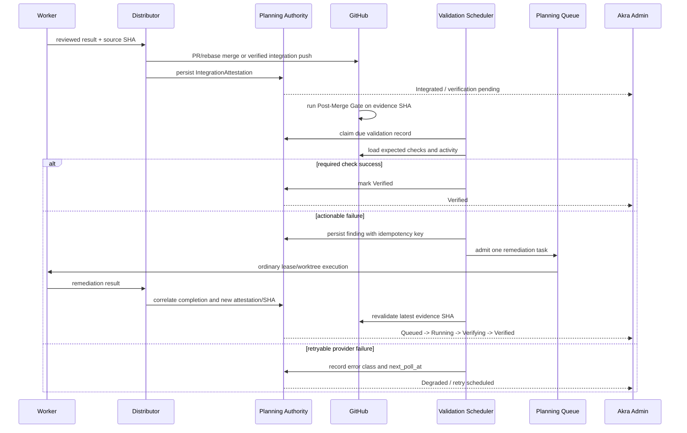

# 비동기 병합 후 검증·복구 Queue·Akra Admin 대응 계획

## 문서 상태

- 상태: **Proposed execution plan** — 아직 현재 제품 동작을 설명하는 reference가 아니다.
- 기준일: 2026-08-09
- 기준 커밋: `e0a80092dde8bf7d33ea92acdab20abdc5154477` (`origin/prerelease`)
- 선행 구현: [PR #2100](https://github.com/RefinedStone/codex-exec-loop/pull/2100),
  [PR #2101](https://github.com/RefinedStone/codex-exec-loop/pull/2101)
- 목적: 현재 durable PR validator를 실제 운영 가능한
  `integration -> post-merge validation -> remediation queue -> revalidation` 시스템으로
  완성하고, 같은 authority를 Akra Admin에서 관찰·재현·운영할 수 있게 한다.
- 사용법: 아래 PR 순서를 위에서부터 실행한다. 각 PR은 최신 `origin/prerelease`에서 만든
  전용 worktree 하나를 사용하고, `CI Gate` 통과 후 rebase merge와 cleanup까지 끝낸 뒤
  다음 PR을 시작한다.

이 문서는 기존 async validator 구현을 폐기하는 재작성안이 아니다. 이미 구현된 상태 머신,
SQLite CAS, remediation correlation, GitHub read adapter, 일반 Planning Queue 연동을 유지하면서
실제 delivery 방식과 GitHub Actions/Ruleset/Admin 계약 사이의 불일치를 바로잡는 후속 계획이다.

## 1. 목표와 완료 정의

권장 운영 모델은 “아무 검증도 없이 병합”이 아니라 **짧은 Fast Gate 이후 병합하고, 긴 검증은
병합 후 비동기로 수행하는 모델**이다.

```text
worker result
  -> PR
  -> Fast Gate
  -> integration/rebase merge
  -> Post-Merge Gate
       -> success: Verified
       -> actionable failure: one durable remediation task
            -> ordinary Planning Queue
            -> ordinary pool lease/worktree/PR/integration
            -> same validation record re-observed
```

다음 조건을 모두 만족해야 이 프로그램이 완료된 것으로 본다.

- `Integrated`와 `Verified`가 도메인, API, Admin, 이벤트 로그에서 구분된다.
- GitHub rebase merge와 distributor cherry-pick integration 모두 동일한 typed
  `IntegrationAttestation`으로 증명할 수 있다.
- 병합 후 검증은 저장된 check contract의 required context와 최신 attempt만 평가한다.
- optional/skipped job, 이전 실패 attempt, workflow container 중복 때문에 validation이 영구
  미완료가 되지 않는다.
- GitHub 일시 장애나 rate limit은 retry/backoff 대상이고, 영구 `Failed`로 즉시 굳지 않는다.
- 여러 Akra 프로세스가 떠 있어도 한 record는 하나의 durable poll lease로만 관찰된다.
- actionable review와 일반 대화/승인/bot noise가 분리된다.
- 같은 finding은 재시작, 중복 poll, cursor replay에도 remediation task를 한 번만 만든다.
- Admin은 모든 active/recent validation record를 읽고, 상세 증거와 Queue correlation을 보여준다.
- Admin의 재시도·pause·resume 명령은 application inbound port를 통하며 CSRF, revision,
  idempotency를 지킨다.
- Debug Harness가 성공, 실패, retry, rate limit, 재시작, 다중 프로세스 경합을 실제 UI 상태로
  결정론적으로 재현한다.
- 운영 Ruleset 변경은 shadow/canary 증거와 사용자의 별도 승인 전에는 수행하지 않는다.

## 2. 현재 구현에서 재사용할 기반

| 영역 | 현재 구현 | 유지할 이유 |
| --- | --- | --- |
| 도메인 lifecycle | `PrValidationPhase`, typed event, terminal reason | illegal transition을 domain에서 차단한다. |
| durable authority | `runtime_pr_validation_records`와 JSON record | 재시작 후 SHA/cursor/finding/remediation을 복구한다. |
| 동시성 | record CAS와 finding idempotency key | 중복 Queue admission을 억제한다. |
| GitHub observation | PR/review/comment/check/workflow REST adapter | raw DTO가 adapter 밖으로 새지 않는다. |
| remediation admission | 일반 Planning Queue task 생성 | validator가 worktree나 slot을 점유하지 않는다. |
| remediation lifecycle | slot 시작과 distributor cleanup hook | ordinary worker 수명주기와 correlation을 이어준다. |
| operator surface | CLI/TUI의 bounded operator summary | 기존 사용자 흐름을 깨지 않고 확장할 수 있다. |
| Admin transport | dashboard bootstrap, SSE invalidation, CSRF control | validation board도 같은 reconciliation 경로를 재사용할 수 있다. |
| Admin Fake | application-owned deterministic debug harness | 실제 DB/Git/GitHub를 건드리지 않고 시나리오를 재현할 수 있다. |

주요 코드 위치:

- `src/domain/parallel_mode/pr_validation.rs`
- `src/application/service/parallel_mode/pr_validation.rs`
- `src/application/service/parallel_mode/slot_lifecycle.rs`
- `src/application/service/parallel_mode/distributor/delivery.rs`
- `src/application/port/outbound/github_pr_validation_port.rs`
- `src/adapter/outbound/github/pr_validation.rs`
- `src/adapter/outbound/db/sqlite_planning_authority_adapter/`
- `src/application/port/inbound/parallel_mode_admin_port.rs`
- `src/adapter/inbound/admin_api/akra_dashboard.rs`
- `src/adapter/inbound/admin_api/api.rs`
- `assets/admin/game/src/`

## 3. 확인된 불일치와 실패 조건

### 3.1 Integration 증거가 실제 delivery와 맞지 않는다

현재 distributor는 reviewed source commit을 전용 integration worktree에 cherry-pick하고,
integration branch를 remote에 push한 뒤 원래 PR을 close한다. 반면 validator는 GitHub PR API의
`merged=true`와 `merge_commit_sha`만 post-merge 증거로 인정하고, closed-unmerged PR은
`PullRequestClosedWithoutMerge`로 block한다.

따라서 정상 distributor delivery가 validator에서는 실패가 될 수 있다. PR 상태를 integration
authority로 쓰지 말고, distributor가 remote verification까지 끝낸 commit을 typed attestation으로
기록해야 한다.

### 3.2 현재 Ruleset은 무검증 선 병합을 허용하지 않는다

2026-08-09 live 확인 기준 ruleset `20411125`는 다음을 요구한다.

- Pull Request 필수
- `CI Gate` 성공 필수
- rebase merge만 허용
- linear history
- bypass actor 없음

PR #2100도 모든 PR check가 끝난 뒤 병합되었다. 그러므로 선행 구현은 “full CI보다 먼저
병합하는 운영 정책”을 실제로 증명하지 않았다. 이 계획은 우선 코드 계약을 바로잡고 shadow
mode로 검증한 뒤, 별도 승인 단계에서 required check를 `Fast Gate`로 축소한다.

### 3.3 현재 push workflow와 성공 판정은 함께 Settled될 수 없다

`scripts/ci-scope.mjs`는 `push` + `refs/heads/prerelease`를 `smoke`로 분류한다. 실제 PR #2100
merge SHA의 push run에서는 `CI Scope`, `Rust Smoke Check`, `CI Gate`만 성공했고 Rust Tests,
Lint, Portable, Node/Admin job은 skipped였다.

현재 `GithubPrValidationSnapshot::is_successfully_complete()`는 그 SHA의 모든 check run과
workflow run이 `Succeeded`여야 true다. 즉 optional/skipped job 하나로 영구 미완료가 된다.
또한 같은 SHA에서 과거 attempt가 실패하고 최신 rerun이 성공해도 과거 실패가 계속 남을 수 있다.

### 3.4 Finding 분류가 semantic하지 않다

현재 adapter는 review state, comment body/actor, review thread resolved 상태를 읽지 않는다.
그 결과 승인 리뷰, LGTM, bot 메시지, 명령 댓글, 해결된 thread까지 remediation 대상으로 변환될
수 있다. issue comment는 target SHA association도 없으므로 과거 일반 대화가 새 task가 될 수 있다.

### 3.5 Polling은 UI/control-plane 수명주기와 API quota에 과결합되어 있다

parallel control-plane은 약 1초 간격으로 pending-dispatch wake를 확인하면서 validator를 호출한다.
한 record의 최소 snapshot은 PR 2회, reviews, issue comments, review comments, check runs,
workflow runs 등 최소 7 REST request다. 연속 실행 시 record 하나가 이론상 시간당 25,200 request를
요구하며, 일반 authenticated REST quota 5,000/hour를 넘는다. active record가 늘면 선형 증가한다.

Admin/TUI 프로세스가 여러 개면 같은 SQLite record를 동시에 읽을 수 있다. CAS는 중복 mutation을
일부 막지만 API traffic과 noisy CAS loss는 막지 못한다. 또한 parallel mode 또는 해당 process가
꺼지면 지속 관찰도 중단된다.

### 3.6 일시 오류와 provider 종료 의미가 잘못되어 있다

- network/429/5xx/auth 일시 오류 한 번이 즉시 terminal `ObservationFailed`가 된다.
- pagination이 현재 끝났다는 이유로 review/comment provider까지 terminal 처리한다.
- Settled record는 poll 대상에서 제외되므로 이후 review나 rerun 변화를 볼 수 없다.
- domain에는 `Watchable`이 있지만 production completion mapping은 이를 사용하지 않는다.

### 3.7 Admin은 validator authority를 직접 표현하지 않는다

`ParallelModeSupervisorSnapshot`은 distributor head와 연결된 validation 하나만 제한적으로
project한다. `AkraAdminDashboardView`는 그 값도 별도 validation view로 매핑하지 않는다.
현재 Admin에서는 다음을 구분할 수 없다.

- integrated지만 CI가 아직 실행 중인 record
- required check 실패와 provider/rate-limit 장애
- remediation queue admission과 실제 worker lease
- 마지막 관측, 다음 poll, stale 시간, retry 횟수
- 여러 active/recent validation record

generic `pr_validation_record_replaced_if_matches` runtime event만으로는 severity와 상태 전이를
안전하게 추론할 수 없다.

## 4. 고정할 설계 결정

1. **정책 기본값은 Fast Gate + Post-Merge Gate다.** broad bypass와 완전 무검증 병합은 기본
   경로가 아니다.
2. **Integration authority는 typed attestation이다.** GitHub PR merge는 가능한 방법 하나다.
3. **검증 대상은 저장된 contract다.** GitHub가 반환한 모든 job을 required로 간주하지 않는다.
4. **workflow run은 진단 container이고 check context가 성공 계약이다.** 같은 실행을 두 번 세지
   않는다.
5. **최신 attempt만 평가한다.** 이전 실패/취소 attempt는 history로만 남긴다.
6. **CI failure만 자동 Queue admission한다.** review/comment는 semantic policy를 통과해야 한다.
7. **GitHub event는 checkout을 직접 변경하지 않는다.** 항상 Planning Queue와 정상 pool lease를
   거친다.
8. **Scheduler는 application/composition 소유다.** TUI widget이나 Admin request handler가 poll
   authority를 소유하지 않는다.
9. **Admin은 DB를 직접 읽거나 쓰지 않는다.** narrow inbound port를 사용한다.
10. **pause/off는 데이터를 삭제하지 않는다.** observation/admission만 중지한다.
11. **새 환경변수 묶음을 만들지 않는다.** typed repo-local 설정으로
    `off | observe | remediate`만 제공한다.
12. **Ruleset 변경은 코드 PR과 분리된 운영 승인이다.** 일반 구현 작업이 protection을 약화하지
    않는다.

## 5. 목표 수명주기



도메인 enum을 전면 교체하지 않는다. 기존 phase는 다음 operator 의미로 정리한다.

| 기존 phase | 목표 operator 의미 |
| --- | --- |
| `Registered` | PR/작업은 등록됐지만 integration 증거가 아직 없다. |
| `PreMergeObservation` | integration 전 review/finding을 관찰한다. |
| `PostMergeObservation` | attested evidence SHA가 integrated되었고 검증 중이다. |
| `RemediationQueued` | finding과 일반 Queue task가 correlation되었다. |
| `RemediationRunning` | 해당 task가 실제 slot lease를 얻었다. |
| `Settled` | 저장된 contract 기준 Verified다. |
| `Blocked` | operator/policy/config 입력 없이는 진행할 수 없다. |
| `Failed` | 재시도로 복구할 수 없는 identity/integrity 위반이다. |

Admin copy에서는 `Settled` 대신 `Verified`, `PostMergeObservation` 대신 `검증 중`을 사용한다.

## 6. 목표 authority와 데이터 계약

### 6.1 IntegrationAttestation

`PrValidationRecord`에 versioned optional attestation을 추가한다.

```rust
struct IntegrationAttestation {
    method: IntegrationMethod,
    source_sha: PrValidationCommitSha,
    base_before_sha: Option<PrValidationCommitSha>,
    evidence_sha: PrValidationCommitSha,
    pull_request_number: Option<u64>,
    github_merge_sha: Option<PrValidationCommitSha>,
    integrated_at: DateTime<Utc>,
    remote_verified_at: DateTime<Utc>,
}

enum IntegrationMethod {
    GithubRebaseMerge,
    DistributorCherryPick,
}
```

- `evidence_sha`가 Post-Merge Gate와 check query의 유일한 target이다.
- distributor는 remote branch fetch와 HEAD 검증이 끝난 뒤에만 attestation을 쓴다.
- GitHub merged PR은 API merge identity를 검증한 뒤 attestation으로 정규화한다.
- PR close는 integration event가 아니다.
- source SHA가 바뀌면 이전 completion/check cursor는 폐기하고 새 lifecycle을 시작한다.

### 6.2 PostMergeValidationContract

record 생성 시점의 계약을 snapshot해서 workflow 변경이 과거 record 의미를 바꾸지 않게 한다.

```rust
struct PostMergeValidationContract {
    version: u32,
    required_check_contexts: Vec<RequiredCheckContext>,
    optional_check_contexts: Vec<CheckContext>,
    completion_source: CheckCompletionSource,
    latest_attempt_only: bool,
}
```

초기 production contract의 권장 required context는 `Post-Merge Gate` 하나다. 이 aggregator가
실제로 요구한 하위 job 결과를 `scripts/ci-scope.mjs`의 gate 함수로 검증한다. `CI Gate`를 그대로
재사용하면 PR과 push 의미가 섞이므로 별도 stable context를 권장한다.

상태 정규화:

- required `success`: 성공
- required `queued | in_progress`: pending
- required `failure | timed_out | cancelled`: actionable failure
- required `skipped | neutral | missing`: workflow/config blocker
- optional `skipped | neutral`: 완료에 영향 없음
- unknown provider value: 성공으로 추정하지 않고 blocked diagnostic

같은 context의 여러 check run은 `check_suite_id`, `started_at`, `completed_at`, provider ID를
이용해 최신 실행 하나를 선택하고, workflow run은 자체 `run_attempt`를 사용한다. workflow run은
URL/attempt/elapsed time을 Admin detail에 제공하지만 required check와 중복 성공 조건으로 세지
않는다.

### 6.3 Durable schedule와 poll lease

authority schema를 additive migration하고 다음 값을 queryable하게 저장한다.

- `next_poll_at`, `last_polled_at`, `poll_attempt`, `consecutive_error_count`
- `poll_lease_owner`, `poll_lease_expires_at`
- `last_error_class`, `rate_limit_remaining`, `rate_limit_reset_at`

권장 scheduler 정책:

- 동일 repository당 동시 poll 1개
- 기본 active interval 30초
- provider error backoff 30초 -> 1분 -> 2분 -> 5분, bounded jitter
- lease TTL은 request timeout보다 길고 owner heartbeat로 갱신
- `Retry-After`, `X-RateLimit-Remaining`, `X-RateLimit-Reset` 우선 적용
- conditional request/ETag가 가능한 endpoint는 cursor와 함께 유지
- process 종료 후 lease expiry로 다른 eligible process가 인수
- `akra`와 `akra admin`은 같은 composition scheduler를 구동하지만 DB claim 승자만 poll
- `observe`는 record만 갱신하고, `remediate`에서만 Queue task를 생성

오류 분류:

| 분류 | 예 | 처리 |
| --- | --- | --- |
| RetryableProvider | timeout, 429, 5xx, transient page race | backoff 후 재시도 |
| AuthenticationBlocked | 401/403 credential/scope | Admin blocker + operator 조치 |
| PolicyBlocked | required context missing/skipped, Ruleset mismatch | contract 조치 |
| IdentityFailed | repository/PR/SHA 불변식 위반 | terminal Failed |
| AdmissionRetryable | Queue CAS/일시 DB contention | 같은 key로 재시도 |
| IntegrityFailed | corrupt record, impossible transition | terminal Failed + 진단 |

### 6.4 ActionableFindingPolicy

기본 정책은 다음 사건만 remediation으로 인정한다.

- required check 최신 attempt의 failure/timed_out/cancelled
- review state `CHANGES_REQUESTED`
- unresolved review thread의 root finding
- 허용된 사람의 명시적 `@akra fix` 또는 `/akra remediate` command

APPROVED, COMMENTED, LGTM, resolved thread, bot/self actor, marker 없는 일반 issue comment,
target SHA보다 오래된 review, thread reply의 중복 root finding은 무시한다.

finding key는 repository, PR, evidence/source SHA, semantic source, stable provider thread/check
identity를 포함한다. 반복 observation은 history만 갱신하고 task를 추가로 만들지 않는다.

### 6.5 Admin read model과 command

`ParallelModeAdminDashboardSnapshot`에 head 하나가 아닌 bounded board projection을 추가한다.

```rust
struct PrValidationBoardSnapshot {
    summary: PrValidationBoardSummary,
    records: Vec<PrValidationAdminRecord>,
    next_cursor: Option<String>,
}
```

각 record는 Akra ID, repository, PR URL, source/evidence SHA, integration method, phase,
expected check 진행률, workflow attempt, finding/remediation/slot correlation, last/next poll,
stale duration, retry/error/rate-limit, revision과 available commands를 제공한다.

runtime event는 generic replacement 대신 `pr_validation_phase_changed`,
`pr_validation_poll_deferred`, `pr_validation_remediation_admitted`,
`pr_validation_verified` 같은 semantic event를 내보낸다.

명령은 application inbound port에 다음 타입으로 추가한다.

- `RetryNow { record_key, expected_revision }`
- `Pause { record_key, expected_revision }`
- `Resume { record_key, expected_revision }`
- `QueueRemediation { record_key, finding_key, expected_revision }`
- `AcknowledgeTerminal { record_key, expected_revision }`

HTTP mutation은 기존 cookie-bound CSRF를 요구하고 stable command ID를 반환한다. 첫 Admin PR은
read-only로 시작하고 mutation은 read model이 안정된 다음 PR에서 연다.

## 7. 구현 PR 순서

각 PR은 아래 공통 절차를 따른다.

1. active work와 open PR을 확인한다.
2. `git fetch origin` 후 최신 `origin/prerelease`에서 전용 `codex/<outcome>` worktree를 만든다.
3. 테스트 또는 실제 fixture로 문제를 먼저 재현한다.
4. `node scripts/agent-plan.mjs`가 지정한 proportional gate를 실행한다.
5. `commit -> push -> PR(prerelease) -> CI Gate -> rebase merge -> cleanup`을 완료한다.
6. 다음 PR은 이전 PR merge 후 시작한다. 불필요한 rebase로 CI를 다시 돌리지 않는다.

### PR 1 — Integration attestation과 legacy migration

권장 branch: `codex/pr-validation-integration-attestation`

- [x] `IntegrationAttestation`과 evidence identity invariant를 domain에 추가한다.
- [x] `merge_sha` 단독 의미를 `evidence_sha` 기반으로 전환하되 기존 JSON을 읽는다.
- [x] authority store schema v11에서 다음 version으로 additive migration한다.
- [x] distributor remote verification 성공 지점에서 attestation을 CAS 저장한다.
- [x] GitHub merged PR을 같은 attestation으로 normalize한다.
- [x] closed-unmerged PR이라도 유효한 distributor attestation이 있으면 검증 단계로 간다.
- [x] attestation 없는 closed PR은 `IntegrationEvidenceMissing` blocker로 둔다.
- [x] TUI/CLI summary에 integration method/evidence short SHA를 추가한다.

주요 파일: domain/service `pr_validation.rs`, distributor delivery, planning authority port,
SQLite adapter와 migration tests.

필수 테스트:

- v11 record data-loss 없는 migration과 migration rollback
- cherry-pick + verified push + PR close의 post-merge 진입
- moved remote head, wrong SHA, stale CAS의 attestation 거절
- GitHub merge와 distributor integration의 authority 충돌 거절
- restart 후 attestation/correlation 복구

완료 조건: 정상 distributor delivery가 closed-unmerged 때문에 Blocked되는 기존 재현이 사라진다.
Ruleset은 이 PR에서 변경하지 않는다.

### PR 2 — Post-Merge check contract와 Actions scope

권장 branch: `codex/post-merge-check-contract`

- [x] `PostMergeValidationContract`를 record 생성 시 snapshot한다.
- [x] check DTO에 app/context, suite identity와 timestamps를, workflow DTO에 `run_attempt`를
      추가한다.
- [x] expected context별 최신 attempt reducer를 pure decision으로 만든다.
- [x] optional/skipped와 required/skipped를 분리한다.
- [x] workflow run은 진단 metadata로 유지하고 check run과 이중 판정하지 않는다.
- [x] `ci-scope.mjs`에 `postmerge` scope를 추가한다.
- [x] prerelease push가 `smoke`가 아닌 `postmerge` plan을 선택하게 한다.
- [x] stable `Post-Merge Gate` job/context를 추가한다.

주요 파일: GitHub validation port/adapter/service, `scripts/ci-scope.mjs`, 관련 Node test,
`.github/workflows/native-pr-checks.yml`.

필수 테스트:

- optional skipped + Post-Merge Gate success의 settle
- required skipped/missing의 policy blocker
- failed attempt 1 뒤 successful attempt 2의 최신 성공 판정
- wrong SHA/run reorder/pagination의 격리
- 실제 PR #2100 push-run 형태 fixture

완료 조건: 실제 push run의 `success + skipped` 조합이 false-incomplete를 만들지 않는다. Ruleset
required context는 아직 바꾸지 않는다.

### PR 3 — Durable scheduler, lease, retry, rate-limit

권장 branch: `codex/pr-validation-durable-scheduler`

- [x] `PrValidationSchedulerService`와 due-record query를 추가한다.
- [x] schedule/lease/rate-limit column을 additive migration한다.
- [x] exact owner/token/expiry CAS로 poll claim, renew, settle을 구현한다.
- [x] control-plane 1초 tick이 모든 record를 직접 poll하지 않게 한다.
- [x] TUI와 Admin process가 같은 scheduler composition을 사용하게 한다.
- [x] retryable/blocked/terminal 오류와 bounded backoff/jitter를 구현한다.
- [x] provider rate-limit/Retry-After 정보를 normalized metadata로 전달한다.
- [x] scheduler mode `off | observe | remediate`를 typed 설정으로 만든다.

필수 테스트:

- 두 process 중 한 owner만 provider를 호출
- owner crash와 TTL 이후 takeover
- 429/5xx/timeout의 예약 재시도
- identity mismatch만 terminal Failed
- five-record repository API budget
- fake time 기반 cadence, UI refresh 독립성

완료 조건: 1초당 최소 7 request 구조가 제거되고 scheduler load가 UI refresh와 분리된다.

### PR 4 — Semantic review/finding policy와 장기 watch 경계

권장 branch: `codex/pr-validation-actionable-findings`

- [x] review state, actor, body marker를 normalized contract에 추가한다.
- [x] GraphQL 또는 동등한 trusted 경로로 thread stable ID와 `isResolved`를 얻는다.
- [x] root/reply를 하나의 thread finding으로 fold한다.
- [x] `ActionableFindingPolicy`를 pure decision으로 구현한다.
- [x] bot/self deny와 explicit human command allow policy를 추가한다.
- [x] CI completion과 review watch lifecycle을 분리한다.
- [x] Verified 이후 late event는 명시적 reopen/correlation 정책을 사용한다.

필수 테스트:

- APPROVED/LGTM/bot/resolved thread의 admission 0회
- CHANGES_REQUESTED/unresolved root의 stable finding 1개
- reply reorder/pagination replay의 duplicate 0회
- explicit marker가 있는 issue comment만 actionable
- 과거 SHA review 격리와 restart 후 late-event 동일성

완료 조건: 일반 사용자 대화가 자동 수정 task가 되는 false positive를 제거하고, watchable
provider를 pagination 완료와 혼동하지 않는다.

### PR 5 — Admin read model, API, SSE

권장 branch: `codex/admin-pr-validation-read-model`

- [ ] bounded board/detail inbound query를 추가한다.
- [ ] 모든 active record와 최근 terminal record를 stable order/cursor로 project한다.
- [ ] Admin dashboard snapshot/view에 validation summary를 추가한다.
- [ ] dashboard bootstrap과 bounded validation endpoint를 제공한다.
- [ ] SSE가 typed validation event에 dashboard invalidation을 발생시킨다.
- [ ] event severity가 phase/error class를 반영하게 한다.
- [ ] secret/raw body/provider token redaction test를 추가한다.
- [ ] 이 PR은 read-only로 유지한다.

필수 테스트:

- distributor head가 아닌 여러 record의 board 노출
- active 우선 stable ordering과 pagination/cursor reset
- SSE reconnect/`Last-Event-ID` 무손실
- Admin adapter concrete DB/service import architecture rejection
- Integrated/Verifying/Remediation/Verified/Provider Blocked JSON 구분

완료 조건: API만으로 integration 증거, check 상태, next poll, Queue correlation을 추적할 수 있다.

### PR 6 — Admin 운영 명령, 게임 UX, Debug Harness

권장 branch: `codex/admin-pr-validation-operations`

- [ ] KPI `검증 중`, `실패`, `복구 Queue`, `stale`를 추가한다.
- [ ] delivery pipeline 아래에 full-width Validation Rail을 추가한다.
- [ ] detail drawer에 checks, attempts, timeline, retry, correlation을 표시한다.
- [ ] color 외 icon/text, keyboard/focus/accessibility DOM projection을 유지한다.
- [ ] 좁은 화면에서는 rail을 card list로 전환한다.
- [ ] 게임 scene에 QA/CI station과 signal packet을 추가한다.
- [ ] passive CI에는 가짜 worker를 만들지 않고 실제 lease 때만 캐릭터를 이동시킨다.
- [ ] typed retry/pause/resume/queue/acknowledge command와 CSRF endpoint를 연결한다.
- [ ] stale revision, duplicate command, observe-mode admission을 안전하게 거절한다.

Debug Harness 필수 시나리오:

1. integration -> Post-Merge Gate success -> Verified
2. check failure -> Queue -> worker -> rerun success
3. optional skipped jobs
4. required context missing/skipped
5. rate limit -> backoff -> recovery
6. provider outage와 RetryNow
7. closed-unmerged + distributor attestation
8. restart during Verifying
9. two-process claim race
10. duplicate event와 late review

검증 명령:

```text
node --check assets/admin/scripts/akra-dashboard.js
npm --prefix assets/admin/game run check
npm --prefix assets/admin/game run build
cargo test akra_graphic_dashboard --lib
bash scripts/check_admin_graphic_visual.sh
```

완료 조건: 열 개 시나리오에서 API, DOM, Pixi inspection이 같은 semantic state를 보고한다.

### PR 7 — Shadow, canary, 운영 정책 전환과 reference 갱신

권장 branch: `codex/post-merge-validation-rollout`

- [ ] 기본 mode `observe`로 실제 PR을 관찰하되 Queue admission을 막는다.
- [ ] 최소 24시간 또는 10개 PR 중 더 긴 조건으로 shadow evidence를 수집한다.
- [ ] quota, false actionable, stale, duplicate, scheduler ownership을 측정한다.
- [ ] production repository에서는 성공 canary만 수행한다. 실패 canary는 test repository 또는
      harness에서 수행한다.
- [ ] shadow 기준 통과 후 mode를 `remediate`로 전환한다.
- [ ] 그 다음에만 사용자 승인으로 Ruleset required context를 측정된 `Fast Gate`로 변경한다.
- [ ] broad bypass actor를 추가하거나 protection을 끄지 않는다.
- [ ] current product/architecture/Admin reference와 한국어 대응 문서를 실제 동작으로 갱신한다.
- [ ] rollback/runbook과 validation artifact를 체크인한다.

Shadow 통과 기준:

- duplicate remediation: 0
- false actionable review/comment: 0
- attested evidence SHA와 Actions target SHA mismatch: 0
- expired lease takeover 실패: 0
- API budget: quota의 50% 미만
- 정상 provider 상태에서 scheduler SLA 2배 초과 stale: 0
- Admin과 CLI/TUI phase 불일치: 0

Ruleset 변경 승인 요청에는 Fast Gate와 기존 CI의 p50/p95, Post-Merge Gate 실패율, shadow
false-positive/duplicate/API 사용량, rollback 절차를 포함한다.

## 8. Dependency와 병렬화 정책

```text
PR 1 Integration Attestation
  -> PR 2 Check Contract/Actions
      -> PR 3 Durable Scheduler
          -> PR 4 Semantic Findings
              -> PR 5 Admin Read Model
                  -> PR 6 Admin Operations/Game UX
                      -> PR 7 Shadow/Policy Rollout
```

PR 1~4는 validator service, GitHub adapter, authority schema를 공유하므로 같은 base에서 병렬
구현하지 않는다. PR 5 merge 뒤 PR 6의 DOM/Pixi 작업과 PR 7의 read-only 측정 도구 준비는 disjoint
worktree에서 가능하지만, Ruleset mutation과 shipped reference 변경은 PR 6 merge 후 확정한다.

## 9. 전체 검증 매트릭스

| 위험 | 필수 자동 검증 | 필수 시나리오 |
| --- | --- | --- |
| record transition | domain unit tests | illegal/stale/reordered event |
| schema migration | SQLite integration tests | v11 보존, rollback |
| integration identity | distributor tests | GitHub merge, cherry-pick, moved head |
| check reducer | adapter/port fixtures | skipped, rerun, missing, wrong SHA |
| scheduler | fake-clock service tests | lease race, crash takeover, 429/backoff |
| finding policy | activity fixtures | approve/LGTM/bot/resolved/command |
| Queue admission | planning/parallel E2E | duplicate poll, exhausted pool, restart |
| Admin API | admin tests | board pagination, detail, redaction, SSE resume |
| Admin game | TS check/build + visual script | harness, responsive detail |
| architecture | `cargo test --test architecture_boundaries` | dependency guard |

최종 구현 slice에서는 최소 다음을 실행한다.

```text
node scripts/agent-plan.mjs
node --test scripts/ci-scope.test.mjs scripts/agent-plan.test.mjs
cargo fmt --all -- --check
cargo test --locked pr_validation -- --nocapture
cargo test --locked --test architecture_boundaries
powershell -File scripts/check_native_pr.ps1 -Mode Full
git diff --check
```

POSIX-only suite와 visual gate는 CI 또는 Linux/WSL 증거에서 보완한다. Windows ACL이나 local
`send-pack` fixture 실패는 무시하지 말고 product failure와 환경 failure를 분리해 기록한다.

## 10. Admin 화면 계약

- Overview는 Delivery 완료와 Verified 수치를 합치지 않는다.
- attention 우선순위는 identity/integrity > auth/rate-limit > check failure > stale다.
- Validation Rail 한 행은
  `PR/Akra ID | Integrated | Actions | Findings | Remediation | Verified` 순서다.
- detail drawer는 attestation, required/optional check, attempt timeline, provider/backoff,
  finding-task-slot correlation, available command와 disabled reason을 제공한다.
- raw comment body, token, credential, unbounded provider payload는 표시하지 않는다.
- QA/CI station은 cloud verification을 signal/console로 표현하고 actor는 실제 worker lease만
  표현한다.
- failure packet이 Queue로 이동하고 task admission 뒤에만 worker 동선이 시작된다.

## 11. 관측성, rollback, 금지 사항

필수 지표는 validation latency, provider request/304, quota, poll lag/stale, lease claim/conflict,
findings/error class, remediation admission/duplicate suppression, Admin command 결과다.

Rollback:

- `remediate -> observe`: 새 Queue admission만 중지한다.
- `observe -> off`: poll을 중지하되 record/history를 삭제하지 않는다.
- Actions contract를 제거하기 전에 active record의 versioned expected context를 보존한다.
- Ruleset은 기존 `CI Gate`로 되돌리고 새 merge admission을 잠근다.
- 잘못된 finding/task는 삭제 대신 cancellation/acknowledgement history를 남긴다.

금지 사항:

- GitHub event handler의 checkout/rebase/cherry-pick/push
- poll 중 slot lease 또는 `PoolMutationLock` 보유
- PR closed를 integration success로 추정
- 모든 run 또는 모든 review/comment를 required/actionable로 간주
- 일시 오류의 첫 시도 terminal Failed 처리
- TUI/Admin refresh tick을 scheduler clock으로 사용
- Admin adapter의 SQLite/GitHub concrete adapter 직접 호출
- UI의 event 문구 parsing 기반 phase/severity 추론
- 일반 코드 작업에서 Ruleset bypass/force push/protection disable
- production prerelease에 의도적인 broken canary 병합

## 12. 최종 Definition of Done

- [ ] 두 integration method 모두 attested evidence SHA로 검증된다.
- [ ] 실제 push workflow fixture가 false-incomplete 없이 settle된다.
- [ ] required latest attempt 실패가 exactly one remediation task를 만든다.
- [ ] retry/backoff/lease가 restart와 다중 process에서 결정론적으로 동작한다.
- [ ] review false-positive fixture가 모두 admission 0회를 보장한다.
- [ ] Admin API/화면에서 Integrated/Verifying/Remediation/Verified가 구분된다.
- [ ] Debug Harness 열 개 시나리오가 API, DOM, Pixi inspection에서 일치한다.
- [ ] shadow 기준을 충족하고 evidence가 체크인된다.
- [ ] Ruleset 변경 여부를 별도 승인받고 결과를 기록한다.
- [ ] current English/Korean reference가 실제 shipped behavior로 갱신된다.
- [ ] 모든 PR이 CI Gate, rebase merge, cleanup을 완료한다.

이 체크리스트가 완료되기 전에는 “선 병합 후 자동 복구 시스템이 production-ready”라고 표현하지
않는다.
