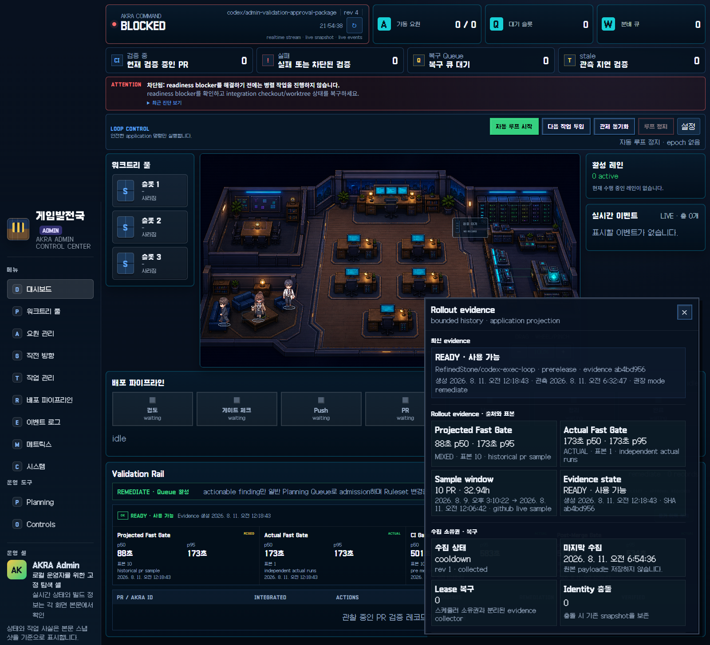
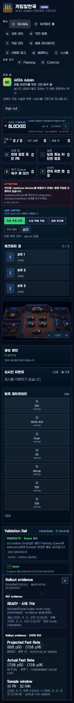

# Admin PR Validation Ruleset Approval Package

This is the read-only approval packet for the shipped PR-validation evidence path. It prepares a
human decision; it does not request or perform a GitHub Ruleset mutation.

## Decision boundary

- Scheduler evidence: `ready_for_remediate`.
- Ruleset review: ready for human review, with no mutation requested.
- Current required context: `CI Gate`.
- Automatic Ruleset mutation: forbidden.
- Broad bypass actors, disabled protection, and evidence-history deletion are outside this package.

The source collector evidence was generated at `2026-08-10T15:18:43.025Z`. At the production Admin
capture (`2026-08-10T21:54:57.421Z`) it was 6.604 hours old, inside the application-owned 48-hour
freshness boundary, and the projected status was `ready`.

## Gate comparison

The rows below compare like-for-like cohorts. The projected-only row excludes the one actual Fast
Gate observation; the actual row compares that observation with `CI Gate` from the same PR run.
The checked-in historical aggregate remains correctly labeled `mixed_actual_and_projected` because
its ten-row sample contains that actual observation.

| Cohort | samples | Fast Gate p50 / p95 | matching CI Gate p50 / p95 | delta |
| --- | ---: | ---: | ---: | --- |
| projected-only matching PRs | 9 | 88s / 101s | 501s / 535s | 413s / 434s faster (82.44% / 81.12%) |
| actual stable Fast Gate | 1 | 173s / 173s | 583s / 583s | 410s faster (70.33%) |

Post-Merge Gate recorded 0 failures in 6 samples. The successful production canary is
[Actions run 31401817497](https://github.com/RefinedStone/codex-exec-loop/actions/runs/31401817497).

## Safety and collection facts

| Fact | observed |
| --- | ---: |
| false actionable admissions | 0 |
| duplicate remediation | 0 |
| healthy-provider stale failures | 0 |
| expired lease takeover failures | 0 |
| Admin/CLI/TUI phase mismatch | 0 |
| evidence SHA mismatch | 0 |
| stale evidence-collection lease recoveries | 0 |
| evidence identity conflicts | 0 |

The original evidence collection used 317 of 5,000 core requests (6.34%) and reported three
collector requests. The read-only Ruleset fact query at `2026-08-10T21:55:49.2263628Z` ran after
the quota window reset and observed 0 of 5,000 requests used.

## Current protection facts

The read-only GitHub API snapshot found repository Ruleset `20411125`, **Protect prerelease
delivery**, active for `refs/heads/prerelease` with:

- deletion and non-fast-forward protection;
- required linear history and pull requests;
- required status check `CI Gate`;
- zero bypass actors.

The legacy branch-protection endpoint is not configured; the repository Ruleset is the active
authority. No Ruleset, bypass, or protection write was issued while producing this packet.

## Production Admin validation

The standalone Admin server used the production composition with an isolated `AKRA_HOME`. The
browser opened the evidence drawer through the authenticated surface and observed it for 15
seconds.

| Measurement | result |
| --- | ---: |
| dashboard bootstrap | 9,709 bytes |
| lazy evidence detail | 9,671 bytes |
| wide DOM nodes | 443 -> 443 |
| wide scroll height | 1,455px -> 1,455px |
| desktop / narrow horizontal overflow | 0px / 0px |
| browser warning or error | 0 |
| main-thread task time during observation | 449.91ms |
| script time during observation | 205.252ms |
| JS heap delta during observation | +252,160 bytes |

The initial narrow capture exposed a pre-existing 5px overflow in the command summary. The branch
metadata and readiness label now stay within the responsive card; the final capture fails if either
the closed or open evidence drawer reintroduces global horizontal overflow.





Machine-readable details are in [`approval-package.json`](approval-package.json) and
[`browser-metrics.json`](browser-metrics.json). The capture source is commit
`c0f961c1d55f3cc3390ddcb2bfaa5923135c994d`.

## Rollback

1. Set repository-local `akra.prValidationMode` to `observe` to block new remediation admission
   while preserving evidence, findings, and Planning Queue history.
2. Use `off` only when provider polling must also stop. Do not delete SQLite evidence or validation
   rows.
3. Settle existing remediation through the typed Planning Queue workflow instead of deleting
   correlation history.
4. If a separately approved Ruleset change has occurred, restore `CI Gate` before investigating
   Fast Gate. Do not add a bypass actor or disable protection.

The full operating procedure remains in
[PR Validation Rollout and Rollback Runbook](../../../reference/pr-validation-rollout.md).

## Reproduction

Build `akra-admin` at the capture commit, start it with a fresh isolated `AKRA_HOME` and a private
Admin capability token, then run:

```text
node scripts/capture_admin_validation_evidence.mjs \
  --browser=<Chromium executable> \
  --url=<authenticated isolated Admin origin>/admin/akra \
  --wide-screenshot=<output>/admin-validation-evidence-wide.png \
  --narrow-screenshot=<output>/admin-validation-evidence-narrow.png \
  --metrics=<output>/browser-metrics.json \
  --commit=c0f961c1d55f3cc3390ddcb2bfaa5923135c994d \
  --observation-ms=15000
```

`AKRA_ADMIN_VISUAL_TOKEN` must be supplied in the process environment. Never record the token in an
artifact.
