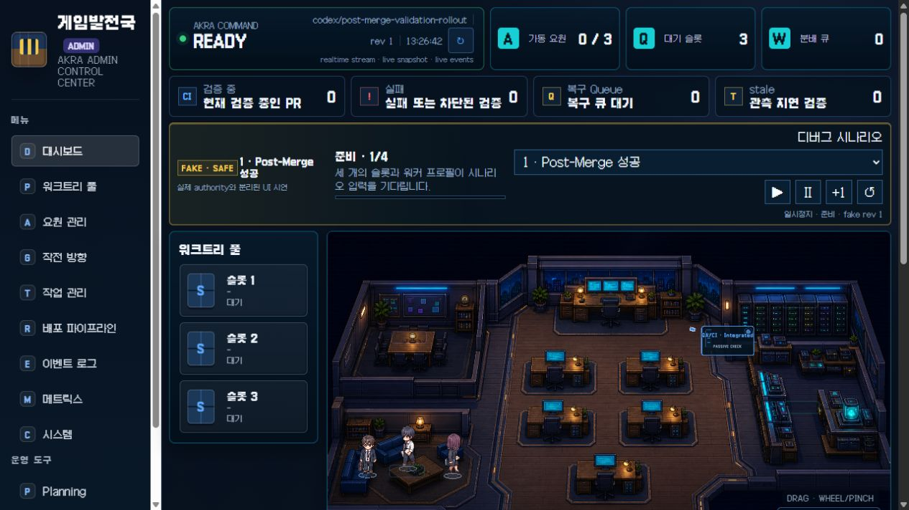
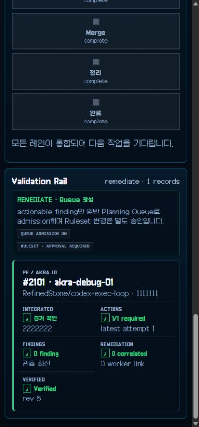

# PR Validation Rollout Evidence

Generated at `2026-08-10T14:46:37.432Z` for `RefinedStone/codex-exec-loop` / `prerelease`.

## Decision

- status: **ready_for_remediate**
- recommended scheduler mode: `remediate`
- Queue admission: enabled
- Ruleset change: **approval_required**; this collector never mutates Rulesets
- rationale: shadow and deterministic canary criteria passed; Ruleset remains unchanged

## Sample Window

- 10 merged PRs
- 32.51 hours from `2026-08-09T04:12:19.000Z` to `2026-08-10T12:43:12.000Z`
- older rows without the stable Post-Merge Gate remain visible as `not available`; they are not counted as successful canaries

| PR | merge SHA | Fast Gate | CI Gate | Post-Merge Gate | Actions target SHA |
| --- | --- | ---: | ---: | ---: | --- |
| [#2111](https://github.com/RefinedStone/codex-exec-loop/pull/2111) | `3b4ef4b4` | 91s (projected_from_existing_jobs) | 535s | 477s / success | pass |
| [#2110](https://github.com/RefinedStone/codex-exec-loop/pull/2110) | `a63fd6d4` | 84s (projected_from_existing_jobs) | 509s | 517s / success | pass |
| [#2109](https://github.com/RefinedStone/codex-exec-loop/pull/2109) | `414e51fb` | 86s (projected_from_existing_jobs) | 512s | 521s / success | pass |
| [#2108](https://github.com/RefinedStone/codex-exec-loop/pull/2108) | `a7f75778` | 94s (projected_from_existing_jobs) | 501s | 492s / success | pass |
| [#2107](https://github.com/RefinedStone/codex-exec-loop/pull/2107) | `8c186b9f` | 87s (projected_from_existing_jobs) | 485s | 528s / success | pass |
| [#2106](https://github.com/RefinedStone/codex-exec-loop/pull/2106) | `48305bdd` | 96s (projected_from_existing_jobs) | 487s | - / not available | pass |
| [#2105](https://github.com/RefinedStone/codex-exec-loop/pull/2105) | `45a512cf` | 88s (projected_from_existing_jobs) | 480s | - / not available | pass |
| [#2104](https://github.com/RefinedStone/codex-exec-loop/pull/2104) | `6ced31be` | 18s (projected_from_existing_jobs) | 29s | - / not available | pass |
| [#2103](https://github.com/RefinedStone/codex-exec-loop/pull/2103) | `e0a80092` | 101s (projected_from_existing_jobs) | 503s | - / not available | pass |
| [#2102](https://github.com/RefinedStone/codex-exec-loop/pull/2102) | `f5653412` | 94s (projected_from_existing_jobs) | 488s | - / not available | pass |

## Gate Timing

Nearest-rank percentiles include queue and job time from workflow creation until the aggregate gate
is complete. Historical Fast Gate values are projected from the exact jobs the new aggregate waits
for; actual values are reported separately once the stable job exists.

| Gate | samples | p50 | p95 | source |
| --- | ---: | ---: | ---: | --- |
| Fast Gate | 10 | 88s | 101s | projected |
| Actual Fast Gate | 0 | - | - | actual |
| CI Gate | 10 | 488s | 535s | actual |
| Post-Merge Gate | 5 | 517s | 528s | actual |

Actual stable Fast Gate runs supplied independently of the merged-PR sample:

- no completed stable Fast Gate run was supplied yet

- Post-Merge Gate failure rate: 0% (0/5)
- GitHub core quota used: 0.12% (6/5000)
- reported core counter delta during collection: 4

## Rollout Criteria

| Criterion | status | observed | limit | evidence |
| --- | --- | --- | --- | --- |
| sampleWindow | pass | {"pullRequests":10,"windowHours":32.51} | {"pullRequests":10,"windowHours":24} | github_live_sample |
| evidenceShaMismatch | pass | 0 | 0 | github_live_sample |
| apiBudget | pass | 0.12 | 50 | github_rate_limit |
| duplicateRemediation | pass | 0 | 0 | deterministic_contract |
| falseActionable | pass | 0 | 0 | deterministic_contract |
| expiredLeaseTakeoverFailure | pass | 0 | 0 | deterministic_contract |
| healthyProviderStale | pass | 0 | 0 | deterministic_contract |
| adminCliTuiPhaseMismatch | pass | 0 | 0 | deterministic_contract |

## Canaries

- production success: pass — [PR #2111 run](https://github.com/RefinedStone/codex-exec-loop/actions/runs/31389346076)
- failure canary: pass — the failure canary ran only in the application-owned harness; no intentionally broken commit entered prerelease

## Browser Validation

- status: **pass**
- viewport checks: 1280x720, 420x900
- horizontal overflow: 0
- console errors: 0
- lifecycle: ready -> delivering -> reviewing -> complete
- validation phases: Integrated -> Verifying -> Verified

## Safety Boundary

The production sample contains no intentionally broken merge. Failure behavior comes from the
deterministic application/Admin harness. Switching the required Ruleset context from `CI Gate` to
`Fast Gate` remains a separate user-approved operation; no bypass actor or protection weakening is
part of this evidence run.
